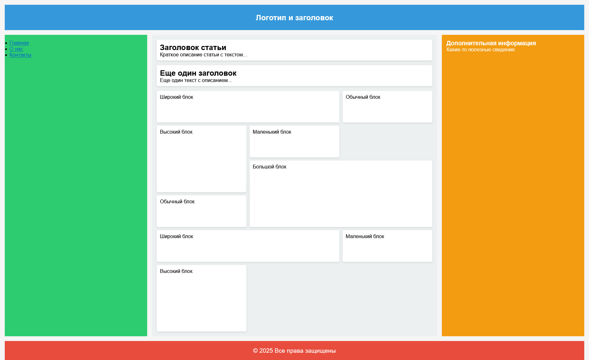

# Применение Grid для верстки страницы

## Цель:

Используя только CSS, оформить готовую HTML-страницу так, чтобы все элементы корректно располагались с помощью Grid.

_Все остальные стили кроме применения самого гридма - даны_

Условия:

- Вам дан файл index.html с готовой структурой страницы.
- Вам нужно дописать CSS-правила в styles.css, чтобы расположить элементы согласно макету, используя только Grid.

## Готовый макет



## Теория

## 1. Включение Grid

```css
.container {
  display: grid;        /* блочный грид */
  display: inline-grid; /* строчный грид */
}
```

---

## 2. Определение колонок и строк

### `grid-template-columns` / `grid-template-rows`

```css
.container {
  grid-template-columns: 200px 1fr 2fr;   /* 3 колонки */
  grid-template-rows: 100px auto 50px;    /* 3 строки */
}
```

### Единицы измерения

| Единица | Описание |
|--------|----------|
| `px`, `%`, `em` | Фиксированные размеры |
| `fr` | Доля свободного пространства |
| `auto` | Размер по содержимому |
| `min-content` | Минимально возможный размер |
| `max-content` | Максимально возможный размер |
| `minmax(min, max)` | Диапазон размеров |

### Функция `repeat()`

```css
grid-template-columns: repeat(3, 1fr);          /* три равные колонки */
grid-template-columns: repeat(auto-fill, 200px); /* авто-заполнение */
grid-template-columns: repeat(auto-fit, minmax(150px, 1fr)); /* резиновая сетка */
```

---

## 3. Отступы между ячейками

```css
.container {
  gap: 20px;             /* строки и колонки */
  row-gap: 10px;         /* только строки */
  column-gap: 30px;      /* только колонки */
}
```

---

## 4. Размещение элементов вручную

### По линиям грида

```css
.item {
  grid-column-start: 1;
  grid-column-end: 3;   /* занимает колонки 1–2 */

  grid-row-start: 1;
  grid-row-end: 2;
}

/* Сокращённая запись */
.item {
  grid-column: 1 / 3;   /* от линии 1 до линии 3 */
  grid-row: 1 / 2;

  grid-column: 1 / span 2; /* с линии 1, шириной 2 колонки */
  grid-row: 2 / -1;         /* от строки 2 до последней линии */
}
```

### Сверхсокращение `grid-area`

```css
.item {
  grid-area: row-start / col-start / row-end / col-end;
  grid-area: 1 / 2 / 3 / 4;
}
```

---

## 5. 🗺 grid-template-areas

Самый наглядный способ описать макет — нарисовать его текстом.

### Как это работает

1. В **контейнере** задаёте «карту» макета строками, где каждое слово — имя зоны:

```css
.container {
  display: grid;
  grid-template-columns: 200px 1fr;
  grid-template-rows: 80px 1fr 60px;
  grid-template-areas:
    "header  header"
    "sidebar main"
    "footer  footer";
}
```

2. Каждому **дочернему элементу** присваиваете имя через `grid-area`:

```css
.header  { grid-area: header;  }
.sidebar { grid-area: sidebar; }
.main    { grid-area: main;    }
.footer  { grid-area: footer;  }
```

3. Пустая ячейка

```css
grid-template-areas:
  "header  header"
  "sidebar main"
  "sidebar .";      /* правый нижний угол — пустой */
```

--- 

## 6. Выравнивание элементов

### Все элементы контейнера

```css
.container {
  /* По горизонтальной оси (inline) */
  justify-items: start | center | end | stretch;

  /* По вертикальной оси (block) */
  align-items: start | center | end | stretch;

  /* Оба сразу */
  place-items: center;          /* align-items justify-items */
  place-items: start end;
}
```

### Весь грид внутри контейнера

```css
.container {
  justify-content: start | center | end | space-between | space-around | space-evenly;
  align-content:   start | center | end | space-between | space-around | space-evenly;
  place-content: center;
}
```

### Отдельный элемент

```css
.item {
  justify-self: start | center | end | stretch;
  align-self:   start | center | end | stretch;
  place-self:   center;
}
```

---

## 7. Неявный грид (implicit grid)

Если элементов больше, чем задано в шаблоне — они попадают в **неявные** строки/колонки.

```css
.container {
  grid-auto-rows: 100px;          /* высота неявных строк */
  grid-auto-columns: 1fr;         /* ширина неявных колонок */
  grid-auto-flow: row;            /* направление размещения: row | column | dense */
}
```

### `grid-auto-flow: dense`

Заполняет «дыры» в сетке, меняя визуальный порядок элементов:

```css
grid-auto-flow: row dense;
```

---

## 8. Сокращения

### `grid-template`

```css
/* grid-template-rows / grid-template-columns */
grid-template: 100px 1fr / 200px 1fr;

/* С areas */
grid-template:
  "header header" 80px
  "sidebar main" 1fr
  "footer footer" 60px
  / 200px 1fr;
```

### `grid`

Полное сокращение (все grid-* свойства):

```css
/* implicit rows / columns и flow */
grid: auto-flow 100px / 1fr 2fr;
```

> ⚠️ Сокращение `grid` сбрасывает все grid-свойства, включая неявные. Используйте с осторожностью.

*Памятка составлена для практического применения. Grid Inspector в DevTools (Firefox/Chrome) — лучший инструмент для отладки сетки.*

## Как сдавать

1. Создайте форк репозитория в организации `31ISP` с названием `uidev-lab5-вашафамилия`
2. Используя ветку `wip` оформите HTML документ `index.html`
3. Зафиксируйте изменения в вашем репозитории
4. Когда документ будет готов - создайте пул реквест из ветки `wip` (вашей) на ветку `main` (тоже вашу) и укажите меня ([ktkv419](https://github.com/ktkv419)) как reviewer

**Не мержите сами коммит**, это сделаю я после проверки задания
